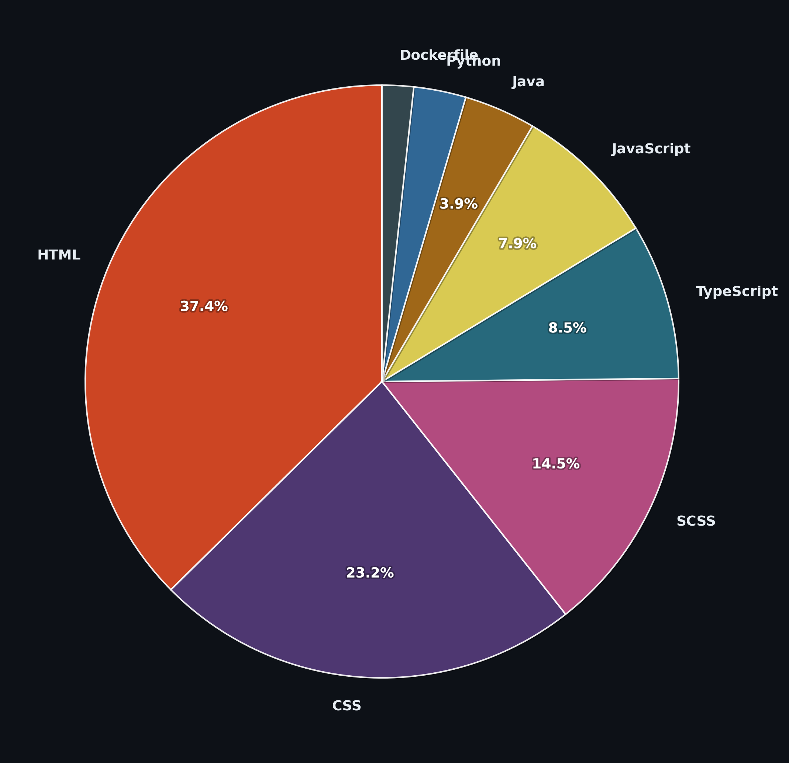

<div align="center">

<br/>


&nbsp;

</div>

---

## 👨‍💻 About Me

```typescript
const luchian = {
  role:     "Web Development Student",
  focus:    ["Full-Stack Development", "Clean Code", "Modern UI"],
  learning: ["React", "Node.js", "TypeScript", "REST APIs"],
  goal:     "Build modern, high-performance & scalable web applications",
};
```

---

## 🛠️ Tech Stack

<div align="center">


</div>

---

## 🗂️ Languages from my Repos

<div align="center">

</div>

---

## 📊 GitHub Stats

<div align="center">

&nbsp;

<br/><br/>

</div>

---

## 📈 Activity

<div align="center">

</div>

---

<div align="center">

</div>
v>
